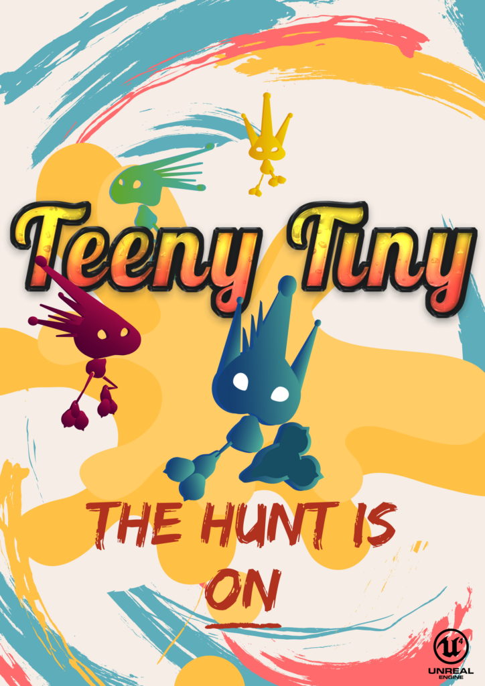

# Teeny Tiny
A multi-player scavenger hunt game done in a team of 6

## Promotional Poster

## Promotional Video
The overall game play is summarized in the promotional video.

## Game Description
Synopsis:

The Tinys were a hidden race trialed by war between two of its races. Due to food and supplies shortages burdened by the prolonged war, the chief of each race sent out a hero to enter the giant’s lair to gather supplies. And thus the race began where you role play as the hero to gather supplies in this scavenger hunt multi-player game.

Objective:

Each Player needs to find and deposit 3 items in order to win the game. Players can use their skills selected at the start of the game to aid themselves or hinder their opponents. Look out for the timer that will appear on the top of the screen and go to any Red Safe Zone before the counter reaches 0 to avoid being spotted by the evil giant and getting killed instantly. The basic UI are summarized in the picture below.

*General UI Layout*

 

*Red Safe Zone. Be sure to be within this kind of tile before the counter reaches 0 to avoid getting instantly killed by the giant.*

 
 

## Multiplayer System
One of the player would serve as the host while the other players will be regular clients. All players are required to log in to their respective STEAM accounts beforehand for the multiplayer system to be completely set up.

*Host*

*Client*

 

Once in the screen shown below, players should select their characters and 4 skills. The client will then press toggle ready once they are done. The Start session will then be lit and the host can now click it to start the game. 

*Host*

*Client*

 
 

## Main Character
The main character was modeled, rigged and animated in blender.

### Modelling

*First Iteration of the Tiny model*

*Final version of the Tiny model*

### Rigging

*Final version of the Tiny model*

### Animating

*Idle animation*

*Walk animation*

*Run animation*

*Jump animation*

 
 

## Download
Download the game [here](https://drive.google.com/open?id=1qgYfEGqNC9BoOOBKUty-dSSsRc0bXwXN)
